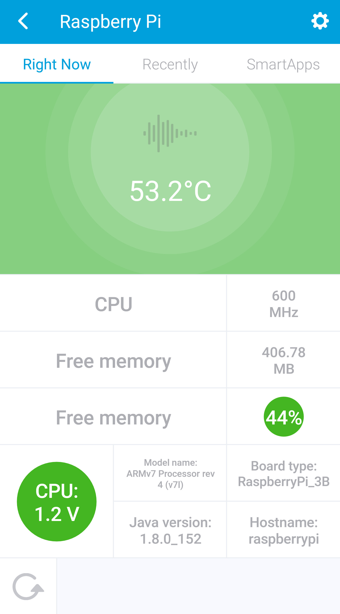

# Raspberry Pi Monitor Device Handler

For the application to run on your Raspberry Pi click [here](https://github.com/cl0udninja/raspberrypi.monitor)

# Overview

The device handler is capable of displaying a couple of information about your Raspberry Pi, such as the

* CPU temperature, speed and core voltage
* Free memory
* Some meta information, like Java version, board type, hostname

# Installation

* Install the [monitor](https://github.com/cl0udninja/raspberrypi.monitor) on your Pi. It's necessary to get the information to show in the device handler. See link above
* Log into the [SmartThings IDE](https://graph.api.smartthings.com)
* Click on *My Device Handlers*
* Click on *Settings* and add a new GitHub repo (cl0udninja/raspberrypi.smartthings/master)
* Click on *Update from Repo* and select *raspberrypi.smartthings(master)*
* In the *New* panel on the right select *devicetypes/cl0udninja/raspberry-pi-monitor.src/raspberry-pi-monitor.groovy* and Publish it
* Install the SmartApp for UPnP discovery in the IDE. Follow the steps [here](..\..\..\smartapps\cl0udninja\raspberry-pi-monitor-discovery.src\README.md)

# Acknowledgements

I took a look at [@nicholaswilde's berryio-smartthings](https://github.com/nicholaswilde/berryio-smartthings) based solution and since I couldn't make it work I decided to swap out the berryio backend with my own. This was my first SmartThings project and his code for the device handler was a great help!

The example on how to do UPnP discovery came from here: [@armzilla's amazon echo bridge](https://github.com/armzilla/amazon-echo-ha-bridge)
